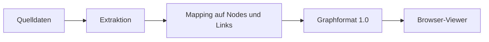

# Datenquellen und Adapter

## Abgrenzung

Eine Datenquelle beantwortet: **Welche Nodes, Links, Eigenschaften und Messwerte gibt es?**

Der Viewer beantwortet: **Wie werden diese Informationen räumlich, visuell und interaktiv dargestellt?**

Die beiden Teile kommunizieren ausschließlich über das versionierte Graphformat.

## Erste konkrete Quelle: C#-Code

C# ist ein sinnvoller erster Exporter, aber nicht der Kern des Viewers. Ein späterer C#-Adapter könnte beispielsweise Folgendes erzeugen:

| Quelle | Graphrepräsentation |
|---|---|
| Namespace oder Modul | Node mit `kind` `namespace` oder `module` |
| Klasse oder Interface | Node mit `kind` `class` oder `interface` |
| Methode | Node mit `kind` `method` |
| Aufrufbeziehung | gerichteter Link mit `kind` `calls` |
| Abhängigkeit | Link mit `kind` `depends-on` |
| Zeilen, Komplexität, Testabdeckung | benannte Node-Metriken |
| Änderungsfrequenz, letzte Änderung | benannte Node-Metriken |

Das sind Beispiele für eine Datenquelle, keine Pflichtfelder des generischen Formats. Ein anderer Adapter kann Nodes für Datenbanktabellen, Microservices, Geräte, Dokumente oder Personen erzeugen.

## Verantwortlichkeiten des Adapters

- Quelldaten einlesen und analysieren,
- stabile IDs erzeugen,
- Nodes und Links deduplizieren,
- Messwerte mit nachvollziehbaren Namen und Einheiten exportieren,
- optional `metricDefinitions` befüllen,
- Referenzen und Datenqualität prüfen,
- ein valides Graph-JSON schreiben.

## Was der Adapter nicht tun soll

- Three.js-Objekte oder CSS-Klassen erzeugen,
- Farben, Glow oder Orbits fest verdrahten,
- aus einer Metrik eine universelle Qualitätsbewertung machen,
- für den Viewer ein Backend voraussetzen,
- Analyse- und Rendering-Logik vermischen.

## Spätere Entwicklung

Die C#-Analyse kann in einem eigenen Projekt oder Verzeichnis entstehen. Sie kann zunächst als Kommandozeilenprogramm eine Datei exportieren. Erst wenn das Graphformat und der Viewer stabil genug sind, lohnt sich die Arbeit an inkrementellen Deltas, Dateiüberwachung, Git-Metriken oder Agenten-Livezuständen.
