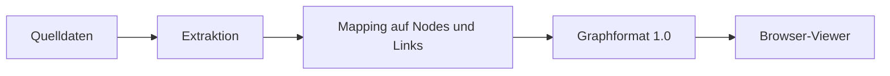

# Datenquellen und Adapter

## Abgrenzung

Eine Datenquelle beantwortet: **Welche Nodes, Links, Eigenschaften und Messwerte gibt es?**

Der Viewer beantwortet: **Wie werden diese Informationen räumlich, visuell und interaktiv dargestellt?**

Die beiden Teile kommunizieren ausschließlich über das versionierte Graphformat.

## Erste konkrete Quelle: C#-Code

C# ist die erste implementierte Datenquelle. Der C#-Adapter analysiert Solutions
und Projekte und erzeugt tatsächlich ein valides, deterministisch sortiertes
Graph-Universe-JSON:

| Quelle | Graphrepräsentation |
|---|---|
| Namespace oder Modul | Node mit `typeId` `namespace` oder `module` |
| Klasse oder Interface | Node mit `typeId` `class` oder `interface` |
| Methode | Node mit `typeId` `method` |
| Aufrufbeziehung | gerichteter Link mit `typeId` `calls` |
| Projekt-, Assembly- und Summary-Abhängigkeit | Links mit den jeweiligen `typeId`-Werten |
| Zeilen, Komplexität, Fan-in und Fan-out | benannte Node-Metriken |
| Globale Scores und Summary-Projektionen | deklarierte Graph-Metriken und Links |

Die Tabelle beschreibt den aktuellen C#-Adapterumfang; sie legt keine Pflichtfelder
des generischen Formats fest. Andere Adapter können mit demselben Vertrag Nodes
für Datenbanktabellen, Microservices, Geräte, Dokumente oder Personen erzeugen.

## Verantwortlichkeiten des Adapters

- Quelldaten einlesen und analysieren,
- stabile IDs erzeugen,
- Nodes und Links deduplizieren,
- Messwerte mit nachvollziehbaren Namen und Einheiten exportieren,
- optional `metricDefinitions` befüllen,
- Referenzen und Datenqualität prüfen,
- ein valides Graph-JSON schreiben.

## Was der Adapter nicht tun soll

- Three.js-Objekte oder CSS-Klassen erzeugen,
- Farben, Glow oder Orbits fest verdrahten,
- aus einer Metrik eine universelle Qualitätsbewertung machen,
- für den Viewer ein Backend voraussetzen,
- Analyse- und Rendering-Logik vermischen.

## Weitere Datenquellen

Der Adapter bleibt eine eigenständige Kommandozeilenanwendung und setzt weder
Viewer-Backend noch Rendering voraus. Inkrementelle Deltas, Dateiüberwachung,
Git-Metriken und Agenten-Livezustände gehören nicht zu seinem aktuellen Scope.
