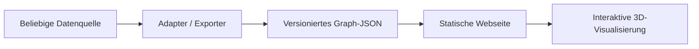

# Graph-Universum – Dokumentation

Dieses Projekt besteht aus zwei bewusst getrennten Teilen:

1. **Graph-Viewer:** Eine statische Webseite lädt eine JSON-Datei im Browser und macht daraus eine interaktive Visualisierung.
2. **Datenquellen:** Werkzeuge analysieren Datenquellen und erzeugen eine JSON-Datei im vereinbarten Graphformat. Der implementierte C#-Adapter ist die erste konkrete Datenquelle.

## Aktive Dokumente

- [01 – Vision](01-Vision.md): Was der quellenneutrale Viewer leisten soll.
- [02 – Visualisierung](02-Visualisierung.md): Aktueller Produktfokus, UX und visuelle Grammatik.
- [03 – Graphformat](03-Graphformat.md): Vertrag für `nodes`, `links`, Metadaten und Metriken.
- [04 – Datenquellen](04-Datenquellen.md): Abgrenzung und der implementierte C#-Adapter.
- [05 – Offene Roadmap](05-Roadmap.md): Kurzer Index beschlossener, noch offener Vorhaben.
- [06 – Graphmodell und Visualisierungsprofile](06-Graphmodell-und-Visualisierungsprofile.md): Allgemeine Vertragserweiterung für Typen, Filter, Projektionen und Themes.
- [07 – C#-Referenzgraph](07-CSharp-Referenzgraph.md): Fachlicher Vertrag und aktueller C#-/Roslyn-Export.
- [08 – Mehrere Visualisierungsmodi](08-Mehrere-Visualisierungsmodi.md): Späteres Feature für Stadtkarte, Universum und biologische Ansichten auf derselben Graph-JSON.
- [99 – Archiv](99-Grob-Konzept-Idee-Archiv.md): Der ursprüngliche, noch vermischte Entwurf.

## Leitbegriffe

- **Node:** Ein eigenständiges Element des Graphen, zum Beispiel eine Klasse, Methode, Datei, Person oder Komponente.
- **Link:** Eine Beziehung zwischen zwei Nodes. Ein Link kann gerichtet sein und eigene Metriken besitzen.
- **Metric:** Eine messbare, quellenabhängige Zahl, zum Beispiel Größe, Komplexität oder Aufrufzahl.
- **Attribute:** Nichtnumerische Eigenschaften wie Tags, Sichtbarkeit oder Status.
- **Mapping:** Die Entscheidung des Viewers, welche Metrik als Größe, Farbe, Linienbreite oder Animation erscheint.

Die Datenquelle liefert Bedeutung und Messwerte. Der Viewer entscheidet über die Darstellung. Diese Trennung ist die zentrale Architekturentscheidung.
